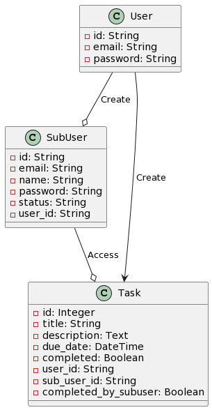
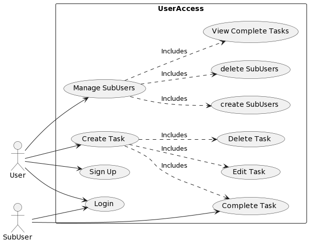

# Overview

Our web application is designed to offer an intuitive task management system, empowering individuals and teams to effortlessly organize and track their tasks with precision. Our goal is to streamline the entire task lifecycle, from creation to assignment and monitoring, fostering seamless collaboration and enhancing overall productivity. Experience the ease of task management as our app transforms the way you work, making organization and teamwork a breeze  

# Design

## User Stories

## US#1

*As a new user, I want to register using the online platform so that I can log in and use the task management system. Given that a user provides a unique ID, their name, email, and password, when the user clicks on the "Sign Up" button then their user information is saved and a customer profile is created.*

## US#2

*As a registered user, I want to log in to create a new task with a title, description, and due date. Since a registered user has provided their ID and password, when the registered user clicks the “Sign In” button then, if their credentials are valid, they are presented with a list of their user tasks if not they will be allowed to create a new task.*

## US#3

*As an authenticated user, I want to assign a task to another user.  Given that a user is logged in and has a task to assign when the user selects another user to assign the task to then the assigned user can see the task in their list.  

## US#4

*As an authenticated user, I want to mark a task as complete.  Given that a user is logged in and has an incomplete task, when the user marks the task as complete, then the task's status changes to complete.  
 

## US#5

*As an authenticated user, I want to view my task list with details about each task.  Given that a user is logged in, when the user accesses their task list, then the task list displays all relevant information.  

## US#6

*As an authenticated admin user, I want to manage user accounts.  Given that an admin is logged in, then the admin performs actions to deactivate, or delete user accounts, then the admin can successfully manage user accounts.  

## Model 

#### UML Class

#### Use Case

#### User Story Diagram #6

# Development Process 

This section should be used to describe how the scrum methodology was used in this project. As a suggestion, include the following table to summarize how the sprints occurred during the development of this project.

|Sprint#|Goals|Start|End|Done|Observations|
|---|---|---|---|---|---|
|1|US#1, US#2,|mm/dd/23|mm/dd/23|US#1|...|
<<<<<<< HEAD
|Sprint 1|Define user stories, design models, break down user stories into tasks, aim to complete US 1 & 2, create dev branch|11/14/2023|11/29/2023|11/29/2023|Observations: The majority of the group has not touched the project and this was discussed in meetings on several occasions|

|Sprint 2|Finish implementing exception handling on US1 & 2, as well as complete US 3 & 4|11/30/2023|12/3/2023|12/3/2023|Observations: This sprint was a struggle still and there was no participation this sprint from Iris, Gabriel, or Brendan;Tyler and Chris found it helpful to assign each other tasks and rely on each other in order starting getting more work done due to the lack luster performance so far from team.|

|Sprint 3| Finish touching up US #2-#4 and start and finish US #5 & 6|12/4/2023|12/7/2023|12/7/2023|Observations: This sprint had a little bit of participation from all members to complete finish touches on the project and was the best sprint by far|

=======
|Sprint 1|US#1 and US#2 was broken down into tasks in Jira|11/14/2023|11/26/2023|US#1|Team tried to meet daily but had other priorities.  Only one user story completed|
>>>>>>> dev

Use the observations column to report problems encountered during a sprint and/or to reflect on how the team has continuously improved its work.

Feel free to use your own format for this section, as long as you are able to communicate what has been described here.

# Testing 

| Test             | Name             | Start | End   | Pass  | Coverage      |
|------------------|------------------|-------|-------|-------|---------------|
| White Box Test   | Mark Task Complete | 12/06 | 12/07 | Pass  | App/Routes 32% |

# Black Box
Our main aim in conducting black-box testing for our task management app was to ensure it's user-friendly and functions properly, just as our users would expect. Using automated tests, we simulated typical user actions, like adding and deleting tasks, logging in, and navigating through the app. This way, we could test the app's features from an outsider's perspective, focusing purely on the user experience. Our goal was to identify and fix any issues that might confuse or inconvenience our users, ensuring the app not only works technically but also feels right to use.

| File                                         | Statements | Missed | Coverage |
|----------------------------------------------|------------|--------|----------|
| app\__init__.py                              | 24         | 4      | 83%      |
| app\forms.py                                 | 23         | 0      | 100%     |
| app\models.py                                | 28         | 0      | 100%     |
| app\routes.py                                | 248        | 158    | 36%      |
| tests\unit\integration\test_task_creation.py | 40         | 1      | 98%      |
| **TOTAL**                                    | **363**    | **163**| **55%**  |

# Deployment 

The final product must demonstrate the integrity of at least 5 of the 6 planned user stories. The final product must be packaged in the form of a docker image. In this section, describe the steps needed to generate that image so that others can deploy the product themselves. All files required for the deployment must be available, including the docker file, source/binary code, external package requirements, data files, images, etc. Instructions on how to create a container from the docker image with parameters such as port mapping, environment variables settings, etc., must be described (if needed). 
