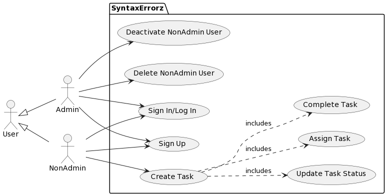

# Overview

Our web app aims to provide a user-friendly task management system to help individuals and teams organize and track their tasks efficiently.  The app will streamline the process of creating, assigning, and monitoring tasks, making collaboration and productivity seamless.  

# Design

## User Stories

## US#1

*As a new user, I want to register using the online platform so that I can log in and use the task management system. Given that a user provides a unique ID, their name, email, and password, when the user clicks on the "Sign Up" button then their user information is saved and a customer profile is created.*

## US#2

*As a registered user, I want to log in to create a new task with a title, description, and due date. Since a registered user has provided their ID and password, when the registered user clicks the “Sign In” button then, if their credentials are valid, they are presented with a list of their user tasks if not they will be allowed to create a new task.*

## US#3

*As an authenticated user, I want to assign a task to another user.  Given that a user is logged in and has a task to assign when the user selects another user to assign the task to then the assigned user can see the task in their list.  

## US#4

*As an authenticated user, I want to mark a task as complete.  Given that a user is logged in and has an incomplete task, when the user marks the task as complete, then the task's status changes to complete.  
 

## US#5

*As an authenticated user, I want to view my task list with details about each task.  Given that a user is logged in, when the user accesses their task list, then the task list displays all relevant information.  

## US#6

*As an authenticated admin user, I want to manage user accounts.  Given that an admin is logged in, then the admin performs actions to deactivate, or delete user accounts, then the admin can successfully manage user accounts.  

## Model 

#### UML Class

#### Use Case

# Development Process 

This section should be used to describe how the scrum methodology was used in this project. As a suggestion, include the following table to summarize how the sprints occurred during the development of this project.

|Sprint#|Goals|Start|End|Done|Observations|
|---|---|---|---|---|---|
|1|US#1, US#2, ...|mm/dd/23|mm/dd/23|US#1|...|
|Sprint 1|Define user stories, design models, break down user stories into tasks, aim to complete US 1 & 2, create branches|Start: 11/14/2023|End|Done|Observations|

Use the observations column to report problems encountered during a sprint and/or to reflect on how the team has continuously improved its work.

Feel free to use your own format for this section, as long as you are able to communicate what has been described here.

# Testing 

Share in this section the results of the tests performed to attest to the quality of the developed product, including the coverage of the tests in relation to the written code. There is no minimum code coverage expectation for your tests, other than expecting "some" coverage through at least one white-box and one black-box test.

# Deployment 

The final product must demonstrate the integrity of at least 5 of the 6 planned user stories. The final product must be packaged in the form of a docker image. In this section, describe the steps needed to generate that image so that others can deploy the product themselves. All files required for the deployment must be available, including the docker file, source/binary code, external package requirements, data files, images, etc. Instructions on how to create a container from the docker image with parameters such as port mapping, environment variables settings, etc., must be described (if needed). 
